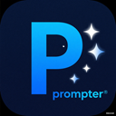
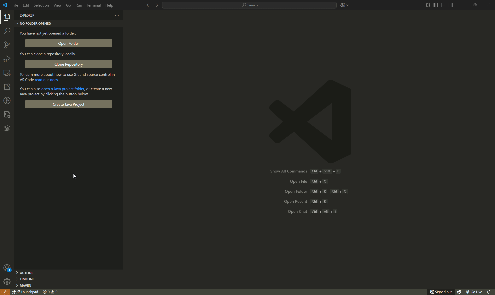

# Prompter - LLM Prompt Management for VSCode

<p align="center">
  
</p>

Prompter is a powerful VSCode extension that brings Jupyter-like notebook functionality to LLM prompt engineering. Create, manage, and execute prompts against various LLM providers directly within your VSCode environment.

## Features

- 🤖 **Multi-LLM Support**: Connect to OpenAI, Anthropic, Deepseek, Qwen, Gemini, and Mistral
- 📝 **Interactive Prompt Cells**: Create and manage prompt cells in a notebook interface
- 💻 **Code Cell Integration**: Mix prompts with executable code cells for complete workflows
- 📊 **Prompt History**: Track and review prompt history
- 🔄 **Run Cells**: Execute individual cells or run all cells in sequence
- 📁 **Notebook Format**: Save your prompt notebooks as `.ppnb` files
- 🎨 **Syntax Highlighting**: Dedicated syntax highlighting for prompt content
- ⚙️ **Configurable Settings**: Customize LLM providers, models, and parameters

## Installation

### Install via VSCode Marketplace

https://marketplace.visualstudio.com/items?itemName=andyqu.prompter-vscode&ssr=false#review-details



## Usage

### Configuring LLM Providers

1. Click the settings gear icon in the notebook toolbar
2. Select your preferred LLM provider (OpenAI, Anthropic, etc.)
3. Enter your API key for the selected provider
4. Configure additional parameters like temperature and max tokens

![Configure LLM] (manual/configure-llm.gif)

### Creating a New Notebook

1. Open the Command Palette (`Ctrl+Shift+P`)
2. Search for "Create Prompter Notebook"
3. A new `.ppnb` file without any cells.
4. Click the prompt button to create prompt cell.


## Development

### Building

```bash
npm run compile
```

### Watching for Changes

```bash
npm run watch
```

### Package Extension

```bash
vsce package
```

## Requirements

- VSCode 1.74.0 or higher
- Node.js and npm
- API keys for your preferred LLM providers

## Contributing

Contributions are welcome! Please feel free to submit a Pull Request.

## License

This project is licensed under the MIT License - see the LICENSE file for details.

## Roadmap

- [ ] Add support for more LLM providers
- [ ] Implement prompt templates and variables
- [ ] Add visualization tools for token usage and costs
- [ ] Enable sharing of prompt notebooks
- [ ] Implement collaborative prompt engineering features
- [ ] Add export functionality (HTML, PDF)